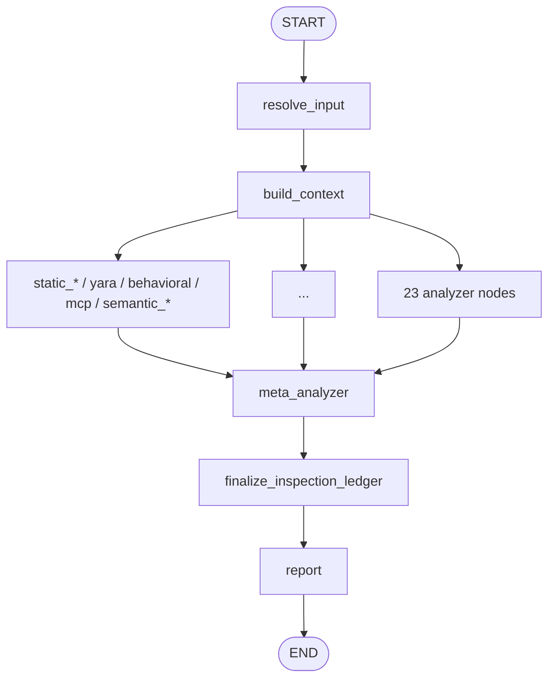

# SkillSpector codebase map and execution call graph

> **Audience:** engineers navigating the Vertex AI fork (`RH-tj/SkillSpector`) to find
> where a capability lives and how a scan executes.
>
> **Related:** [DEVELOPMENT.md](DEVELOPMENT.md) (how to run/extend),
> [CAPABILITIES.md](CAPABILITIES.md) (what detections exist),
> [WHY_LLM_ANALYSIS.md](WHY_LLM_ANALYSIS.md) (why LLM nodes exist).

---

## 1. Package layout (capability → location)

| Area | Path | Primary symbols |
|------|------|-----------------|
| CLI entry | `src/skillspector/cli.py` | `scan()`, `_scan_multi_skill()`, `baseline()` |
| MCP server entry | `src/skillspector/mcp_server.py` | `run_scan()`, `scan_skill()` |
| Graph wiring | `src/skillspector/graph.py` | `create_graph()`, module `graph` |
| Pipeline state | `src/skillspector/state.py` | `SkillspectorState`, `llm_call_record()` |
| Finding model | `src/skillspector/models.py` | `Finding`, `AnalyzerFinding` |
| Input resolution | `src/skillspector/nodes/resolve_input.py` | `resolve_input()` |
| Context build | `src/skillspector/nodes/build_context.py` | `build_context()` |
| Analyzer registry | `src/skillspector/nodes/analyzers/__init__.py` | `ANALYZER_NODE_IDS`, `ANALYZER_NODES` |
| Static runner | `src/skillspector/nodes/analyzers/static_runner.py` | `run_static_patterns()`, `run_static_patterns_with_ledger()` |
| Pattern metadata | `src/skillspector/nodes/analyzers/pattern_defaults.py` | `PatternCategory`, remediations/explanations |
| Meta-analyzer | `src/skillspector/nodes/meta_analyzer.py` | `meta_analyzer()`, `LLMMetaAnalyzer` |
| Ledger finalize | `src/skillspector/nodes/finalize_inspection_ledger.py` | `finalize_inspection_ledger()` |
| Report / score | `src/skillspector/nodes/report.py` | `report()`, risk scoring, SARIF |
| Dedup | `src/skillspector/nodes/deduplicate.py` | dedupe helpers used by report |
| Analyzer guard | `src/skillspector/inspection_ledger.py` | `guard_analyzer_node()`, ledger events |
| LLM factory | `src/skillspector/llm_utils.py` | `get_chat_model()`, `is_llm_available()` |
| LLM analyzer base | `src/skillspector/llm_analyzer_base.py` | `LLMAnalyzerBase`, batching, structured output |
| Rate limiter | `src/skillspector/rate_limiter.py` | `rate_limited_ainvoke()`, `rate_limited_invoke()` |
| Severity gate | `src/skillspector/severity_utils.py` | `meets_min_severity()`, `filter_findings_by_min_severity()`, `should_skip_llm_analyzer()` |
| Vertex provider | `src/skillspector/providers/vertex/` | `ChatAnthropicVertex` wiring (fork-only) |
| Multi-skill detect | `src/skillspector/multi_skill.py` | `detect_skills()` |
| Suppressions | `src/skillspector/suppression.py` | baseline rules + fingerprints |
| OSV client | `src/skillspector/nodes/analyzers/osv_client.py` | used by supply-chain SC4 |
| Python AST helpers | `src/skillspector/python_ast.py` | AST cache helpers for behavioral analyzers |

**Protected fork files** (do not overwrite with upstream): see `AGENTS.md` / `CLAUDE.md` — especially `providers/`, `llm_utils.py`, `rate_limiter.py`, `meta_analyzer.py`, `cli.py`, `state.py`.

---

## 2. Capability map (what → which analyzer)

### 2.1 Static pattern analyzers

Each module exposes `analyze(content, file_path, file_type) -> list[AnalyzerFinding]` and a LangGraph `node(state)` that calls `run_static_patterns_with_ledger` / `run_static_patterns`.

| Capability / threat | Rule IDs | Module |
|---------------------|----------|--------|
| Prompt injection | P1–P4, P9 | `static_patterns_prompt_injection.py` |
| Data exfiltration | E1–E5 | `static_patterns_data_exfiltration.py` |
| Privilege escalation | PE1–PE5 | `static_patterns_privilege_escalation.py` |
| Supply chain (+ OSV) | SC1–SC8, TR1–TR3 | `static_patterns_supply_chain.py` (+ `osv_client.py`) |
| Harmful content | P5 | `static_patterns_harmful_content.py` |
| Excessive agency | EA1–EA4 | `static_patterns_excessive_agency.py` |
| Output handling | OH1–OH3 | `static_patterns_output_handling.py` |
| System prompt leakage | P6–P8 | `static_patterns_system_prompt_leakage.py` |
| Memory poisoning | MP1–MP3 | `static_patterns_memory_poisoning.py` |
| Tool misuse | TM1–TM4 | `static_patterns_tool_misuse.py` |
| Rogue agent | RA1–RA2 | `static_patterns_rogue_agent.py` |
| Agent snooping | AS1–AS3 | `static_patterns_agent_snooping.py` |
| Anti-refusal / jailbreak | AR1–AR3 | `static_patterns_anti_refusal.py` |
| SSRF | SSRF1–SSRF3 | `static_patterns_ssrf.py` |
| Whitespace padding helper | (used by P9 path) | `whitespace_padding.py` |

**Planned (not yet in tree):** CoT forgery CF-* → `static_patterns_cot_forgery.py`; role confusion RC-* → `static_patterns_role_confusion.py` ([APPSRE-14806](https://redhat.atlassian.net/browse/APPSRE-14806) / [14805](https://redhat.atlassian.net/browse/APPSRE-14805)).

### 2.2 Other static / structured analyzers

| Capability | Rule IDs | Module | Notes |
|------------|----------|--------|-------|
| YARA malware / agent signatures | YR* | `static_yara.py` | Optional `--yara-rules-dir` |
| Dangerous Python constructs | AST1–AST9 | `behavioral_ast.py` | AST, no LLM |
| Source→sink taint | TT1–TT5 | `behavioral_taint_tracking.py` | AST data-flow, no LLM |
| MCP least privilege | LP1–LP4 | `mcp_least_privilege.py` | Manifest vs behavior |
| MCP tool poisoning | TP1–TP4 | `mcp_tool_poisoning.py` | TP1–3 static; **TP4 uses LLM** |
| MCP rug pull | RP1–RP3 | `mcp_rug_pull.py` | Unpinned refs / pre-staging |

### 2.3 LLM semantic analyzers

All subclass / use `LLMAnalyzerBase`; skip when `state["use_llm"]` is False (`--no-llm`).

| Capability | Rule IDs | Module |
|------------|----------|--------|
| Semantic security discovery | SSD-1–SSD-4 | `semantic_security_discovery.py` |
| Developer intent mismatch | SDI-1–SDI-4 | `semantic_developer_intent.py` |
| Quality / policy | SQP-1–SQP-3 | `semantic_quality_policy.py` |

### 2.4 Cross-cutting pipeline capabilities

| Capability | Where implemented |
|------------|-------------------|
| False-positive filter + enrich findings | `meta_analyzer.py` (`LLMMetaAnalyzer`) |
| Fail-closed when LLM down | `meta_analyzer.py` + ledger degradation |
| Severity-gated floor (HIGH/CRITICAL survive LLM doubt) | `meta_analyzer.py` (fork) |
| `--min-severity` analysis gate | `severity_utils.py` + static_runner, meta_analyzer, semantic skip helpers, CLI |
| Inspection completeness | `inspection_ledger.py` → `finalize_inspection_ledger.py` |
| Risk score / SARIF / formats | `report.py`, `sarif_models.py` |
| Baseline suppressions | `suppression.py` + CLI `baseline` |
| Vertex-only LLM transport | `llm_utils.py` → `providers/vertex/` |
| Eval-dataset path skipping | `static_runner.py` (`_is_eval_dataset`); see [EVAL_DATASETS.md](EVAL_DATASETS.md) |

---

## 3. Execution call graph

### 3.1 High-level LangGraph topology

Built by `create_graph()` in `graph.py`:

```
START
  → resolve_input
  → build_context
  → [fan-out] each analyzer in ANALYZER_NODE_IDS
        (each wrapped by guard_analyzer_node)
  → [fan-in] meta_analyzer
  → finalize_inspection_ledger
  → report
  → END
```

Analyzers run **concurrently** from `build_context`; all must complete before `meta_analyzer`.



### 3.2 CLI → graph call chain

```
skillspector scan <path>
  cli.scan()
    detect_skills()                    # multi_skill.py — optional recursive split
    graph.invoke(state)                # or _scan_multi_skill → per-skill invoke
      resolve_input()                  # URL/zip/dir → skill_path, temp_dir
      build_context()                  # components, file_cache, manifest, metadata
      for each analyzer_id:
        guard_analyzer_node(id, node)
          ANALYZER_NODES[id](state)    # appends to findings via reducer
      meta_analyzer(state)             # → filtered_findings (or passthrough)
      finalize_inspection_ledger()
      report()                         # score, dedupe, format, SARIF
    cleanup temp_dir_for_cleanup
    print / write report_body
```

State flags set by CLI before invoke (representative):

- `use_llm = not no_llm`
- `output_format`, `min_severity`, `yara_rules_dir`, baseline paths, etc.

### 3.3 Static analyzer internal call chain

```
static_patterns_<category>.node(state)
  → run_static_patterns_with_ledger(state, [module])
       → run_static_patterns(state, pattern_modules)
            for path in components:
              module.analyze(content, path, file_type)
                → list[AnalyzerFinding]
              analyzer_finding_to_finding(...)
            filter_findings_by_min_severity(...)
       → ledger status events
  → { "findings": [...], ledger events... }
```

### 3.4 LLM semantic analyzer call chain

```
semantic_*.node(state)
  if not use_llm: return empty findings
  if should_skip_llm_analyzer(...): return empty   # e.g. min_severity gate
  LLMAnalyzerBase subclass
    get_chat_model()                 # llm_utils → Vertex
    rate_limited_ainvoke / batches   # rate_limiter + llm_analyzer_base
    parse structured findings
  → Findings with SSD/SDI/SQP rule IDs
```

Same pattern for **TP4** inside `mcp_tool_poisoning.node` (static TP1–3 always; TP4 only if `use_llm`).

### 3.5 Meta-analyzer call chain

```
meta_analyzer(state)
  if not use_llm:
    passthrough / default remediations → filtered_findings
  else:
    LLMMetaAnalyzer (LLMAnalyzerBase)
      batch findings per file
      LLM: is_vulnerability? confidence? explanation? remediation?
      drop low-confidence FPs
      severity-gated floor: keep HIGH/CRITICAL even if LLM unconfirmed
      min_severity filter
  llm_call_record() → state llm_call_log
  → filtered_findings
```

### 3.6 Report call chain

```
report(state)
  take filtered_findings (or findings)
  deduplicate
  apply baseline suppressions
  compute risk_score / severity / recommendation
  render terminal | json | markdown | sarif
  → report_body, sarif_report, risk_*
```

---

## 4. How to extend (quick pointers)

| Goal | Do this |
|------|---------|
| Add static regex rules | New or existing `static_patterns_*.py` + `pattern_defaults.py` + register in `analyzers/__init__.py` |
| Add LLM discovery checks | Subclass `LLMAnalyzerBase`; register node; gate on `use_llm` |
| Change Vertex model / auth | `llm_utils.py` + env (`ANTHROPIC_VERTEX_PROJECT_ID`, `SKILLSPECTOR_MODEL*`) — never add non-Vertex providers |
| Change pipeline shape | `graph.py` only |
| Change CLI flags | `cli.py` → state fields in `state.py` |

---

## 5. Tests that encode the call graph

| Layer | Example tests |
|-------|----------------|
| Graph smoke (`use_llm=False`) | `tests/integration/test_graph_scanner.py` |
| Meta-analyzer `--no-llm` | `tests/integration/test_meta_analyzer_use_llm.py` |
| Semantic analyzers (mocked LLM) | `tests/nodes/analyzers/test_semantic_*.py` |
| Min-severity gate | `tests/nodes/test_min_severity_analysis_gate.py` |
| Static patterns | `tests/nodes/analyzers/test_static_*.py` (and related) |

Unit tests for LLM nodes **mock** `get_chat_model` / structured output — they validate wiring and parsing, not live model judgment. Live Vertex evaluation is manual / integration outside the default CI path.
